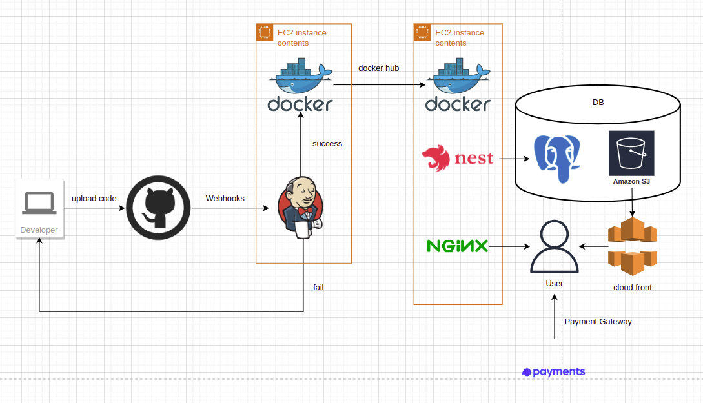
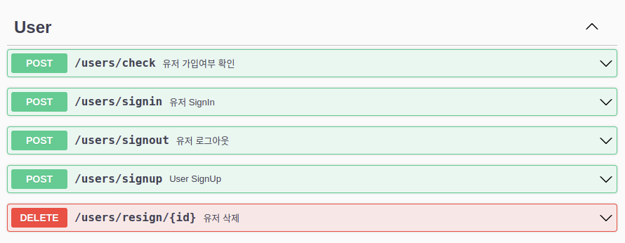
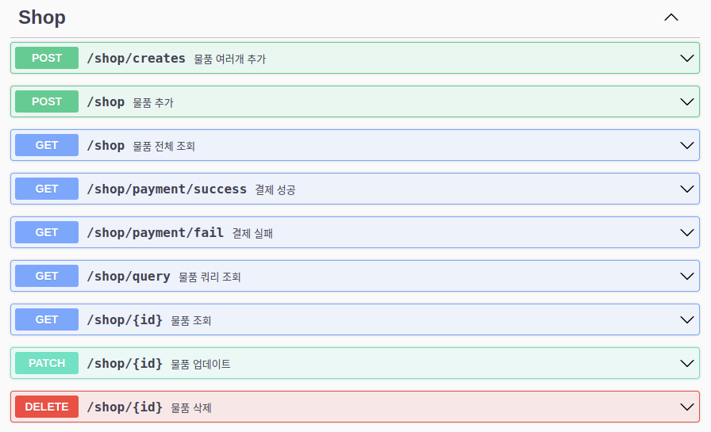
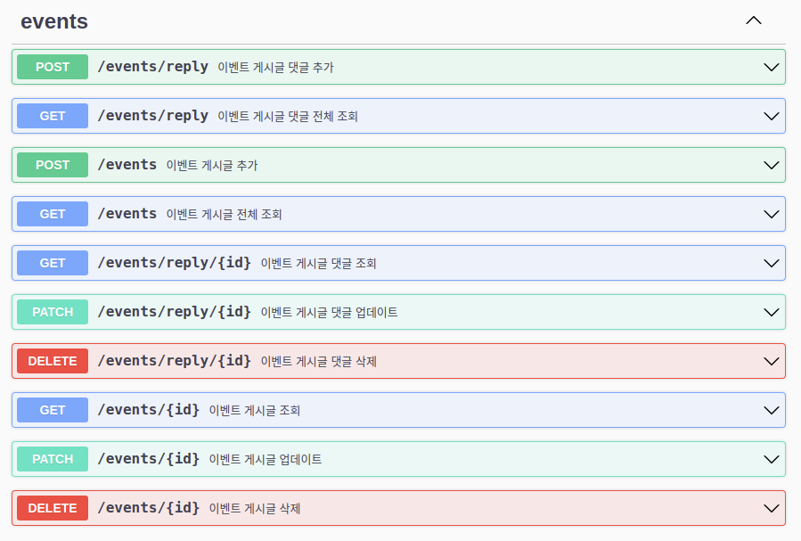
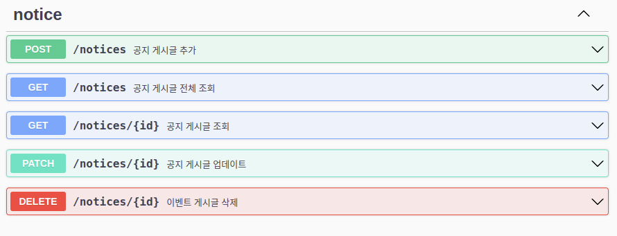
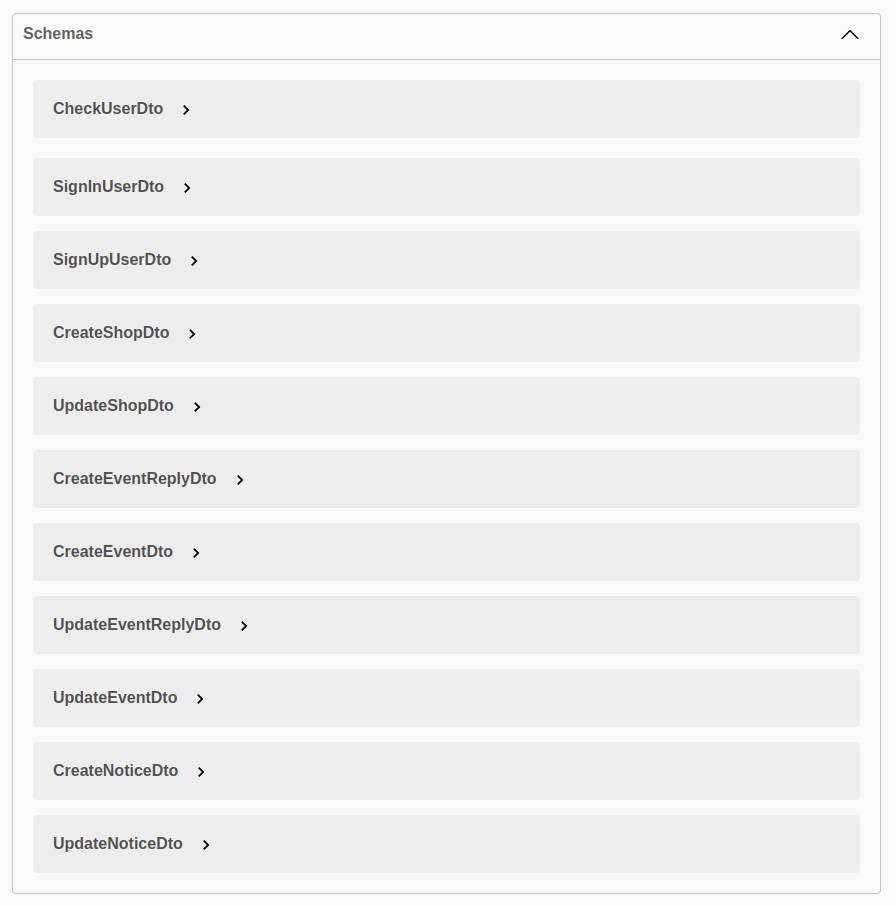
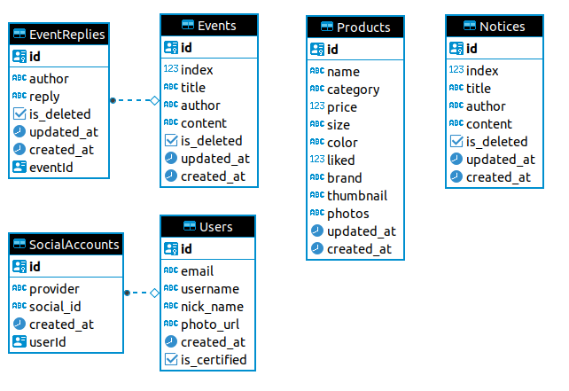

<div align="center">
  <h3>Hackathon Shop</h3>
  <h3>해커톤 쇼핑몰</h3>
</div>
<div align="center">
    <a href="https://hackathonshop.vercel.app/">https://hackathonshop.vercel.app
    </a>
</div>
</br>
<div align="center">


</div>

# Description

A template hackerton shop to quickly create a mall homepage.

Take a look at Hackerton Shop and build your own shopping mall!

</br>

# Quick Start Guide

### 1. installation

```bash
git clone https://github.com/Jabee7531/hackathonshop-server.git
cd hackathonshop-server
yarn
```

### 2. set up `.env` file

```
ENV=development

CORS_ALLOWED_ORIGINS=your_client_url

DATABASE_HOST=your_database_url.com
DATABASE_PORT=5432
DATABASE_USERNAME=username
DATABASE_PASSWORD=password
DATABASE_DATABASE=postgres
DATABASE_SYNCHRONIZE=true

JWT_SECRET=secret
JWT_EXPIRATION_TIME=24000
Payment_SecretKey=toss_payment_key
```

### 3. start

```
yarn start:dev
```

<br/>

# Project & CI/CD architecture



<br/>

# API List







<br/>

# ERD



<br/>

# Performance Test

-   Test by [PageSpeed Insights](https://pagespeed.web.dev/)


</br>

# Stress Test

-   Test by [Artillery](https://www.artillery.io/) (100 users, 10 requests)


# License

MIT License

</br>
</br>
</br>

# 요약

쇼핑몰 홈페이지를 빠르게 만들기 위한 템플릿 해커톤 숍 입니다.

해커톤 숍을 참고 하여 자신만의 쇼핑몰을 만들어 보세요 !

</br>

# 빠른시작

### 1. 설치하기

```bash
git clone https://github.com/Jabee7531/hackathonshop-server.git
cd hackathonshop-server
yarn
```

### 2. `.env`파일 설정

```
ENV=development

CORS_ALLOWED_ORIGINS=your_client_url

DATABASE_HOST=your_database_url.com
DATABASE_PORT=5432
DATABASE_USERNAME=username
DATABASE_PASSWORD=password
DATABASE_DATABASE=postgres
DATABASE_SYNCHRONIZE=true

JWT_SECRET=secret
JWT_EXPIRATION_TIME=24000
Payment_SecretKey=toss_payment_key
```

### 3. 시작하기

```
yarn start:dev
```

<br/>

# 프로젝트 & CI/CD 아키텍쳐


<br/>

# API 목록


<br/>

# ERD


<br/>

# 성능 테스트

-   [PageSpeed Insights](https://pagespeed.web.dev/)를 사용한 테스트 결과


</br>

# 스트레스 테스트

-   [Artillery](https://www.artillery.io/)을 사용한 테스트 결과(100명의 사용자, 10개의 요청)


</br>

# 라이센스

MIT License
